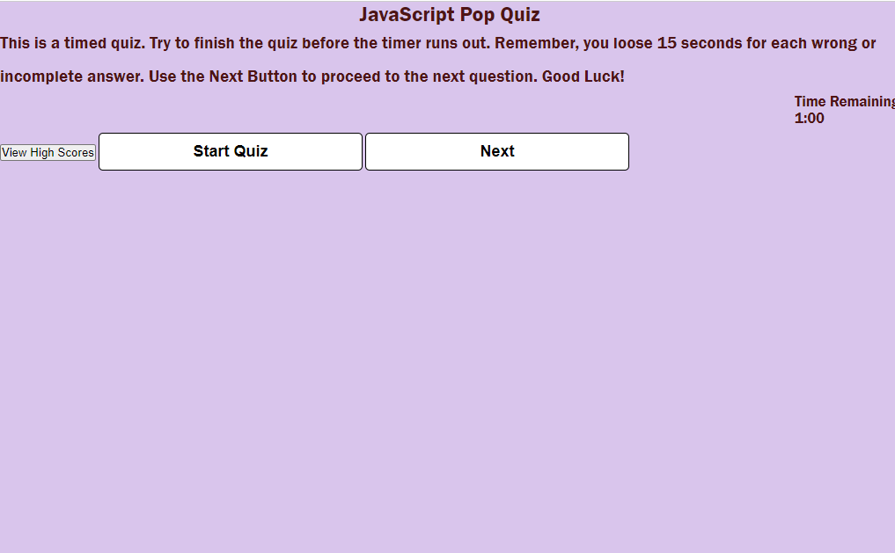
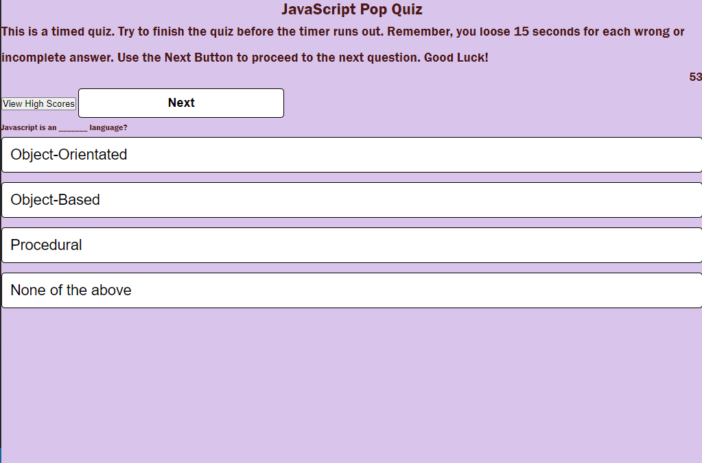

## JAVASCRIPT QUIZ APP
***
 *JavaScript Quiz App* is an "online quiz app" using HTML, CSS, JS and Prettier.

## Images of the deployed website:
***

## Main Page

## Questions Page

## User Story
***
A fun way to test a user's JavaScript knowledge.

## As a user:
*I would like to test my knowledge of JavaScript.*
***
   **TEST** my JavaScript Knowledge.

   **LEARN** where I need to improve my JavaScript Knowledge, by 

 *I would like to save my score, to test my level of improvement*
 ***
  
  ## HOW TO USE THE APP
  ***
  
  Open the app in the browser and click start. The score will be updated with each question. 1 point is added to the score when the user answers correctly and 0 points + 15 seconds will be deducted from the timer for each incorrect answer. When the user answers all questions and or the timer hits zero, the game will be over. the user then enters thier initials to save to the highscores list. They can either leave the app or restart the game for a better score.

  ## TECHNOLOGY USED
  ***
    HTML 
    CSS 
    JS 
    prettier

## THE DEPLOYED REPO CAN BE FOUND AT THE FOLLOWING URL:
***

  ## INSTALLATION OF THE REPO FROM GITHUB
  ***
  A copy of the repository can be cloned at https://github.com/. Simply click on the repo and select **Clone**. From the drop down menu select the copy icon. Type (directly into your terminal):
  'git clone' + 'the repo link' + enter.

  ## FUTURE ITERATIONS
  ***
  **ANIMATION**- I would like to add animation to the game. Making the answers whether correct or wrong a bit more fun.
  
  ## CREDITS
  ***

  **Collaborators**
  1. Marie Pacheco github: https://github.com/Lycanchic